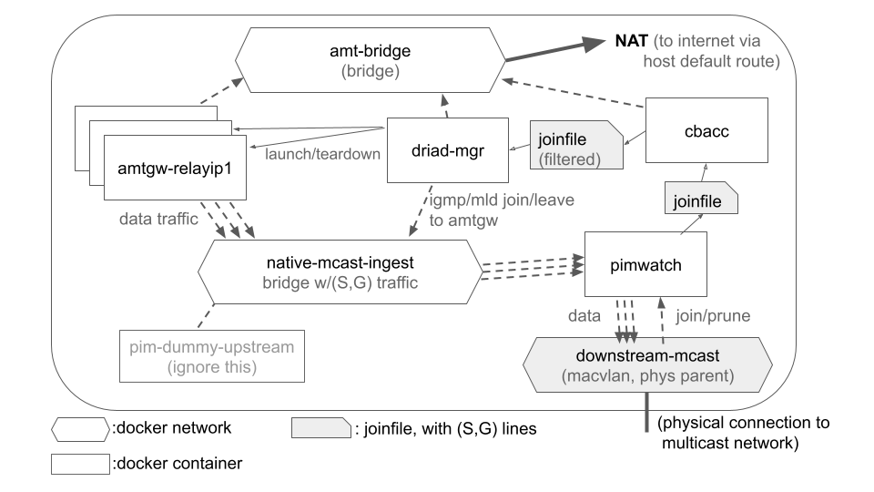

# Intro

This is a guide for setting up an ingest platform to pull in multicast
traffic originating outside your local network.

At this stage only IPv4 is supported.  Once IPv6 is supported in
[FRR](https://frrouting.org/)'s and/or an [open-source pimd](https://github.com/troglobit/pimd) implementation of [PIM](https://tools.ietf.org/html/rfc7761), we hope to upgrade this project to support IPv6 as well.

This is a [DRIAD](https://tools.ietf.org/html/rfc8777)-based proof of concept that responds to [SSM](https://tools.ietf.org/html/rfc4607) joins to externally-supplied (S,G)s by ingesting multicast traffic from outside the local network.  It works by discovering an AMT relay that's specific to the source of the (S,G).  It uses no explicit source-specific configuration, and has no explicit peering with the source's network.

This concept was first presented at the mboned meeting at IETF 103:

 * [Video](https://www.youtube.com/watch?v=bCy7j-DoGGc&t=56m38s)
 * [Slides](https://datatracker.ietf.org/meeting/103/materials/slides-103-mboned-draft-jholland-mboned-driad-amt-discovery-00)

The idea is to make it so if someone on the internet is providing multicast reachable via an AMT relay, you can receive it as multicast within your network by setting up an ingest device according to these instructions, as long as the sender has set up the appropriate metadata and DNS records to support discovery.

You'll need to get your network to propagate source-specific PIM Join messages to this device for joins to (S,G)s from outside your network.
But as long as you can do that, you shouldn't need anything special configured in order to support multicast from different sources--anyone who sets up the right AMTRELAY DNS record in the DNS reverse IP tree for their source's IP should be able to provide traffic to your network's clients.

(NB: if you're using the [sample-network setup](sample-network), there is unfortunately a [route added](sample-network/border-rtr/etc/frr/staticd.conf#L12) for our known source IPs at present.
This is a workaround because FRR's MRIB does not yet work right.  We hope to
also remove this hacked static route when we can get FRR's rpf fixed.
This source-specific configuration should not be required for a Cisco- or Juniper- based network, because configuring a default route for the multicast routing table toward the ingest point works on those platforms.)

# Design

You can skip this section if you just want to make it run, but this is a brief overview of what will end up running on the ingest platform device and what its behavior is.

## Overview

The goal is to send externally generated multicast traffic by making a tunnel to an auto-discovered [AMT](https://tools.ietf.org/html/rfc7450) relay for traffic joined by subscribers within your network.

There are a several components the platform uses to achieve this goal, detailed below.  Here's the overall diagram:

## Docker Containers

 - multiple `amtgw` gateway containers (one per actively subscribed source IP).\
   Each of these runs an AMT gateway instance, which forms a unicast tunnel with the AMT relay associated with the source IP
 - one `driad-ingest` container.\
   This uses [DRIAD](https://tools.ietf.org/html/rfc8777) to discover the appropriate AMT relay given the source IP (from the (S,G)), launches the AMT gateway containers as needed, and maintains an IGMP/MLD join locally, which the AMT gateway will use.
 - one `pimwatch` container.\
   This establishes a [PIM](https://tools.ietf.org/html/rfc7761) adjacency with the downstream multicast network and monitors join/prune events from the network to determine the current set of joined (S,G)s (exported via a joinfile).  It also forwards the multicast traffic from the docker network where the amtgw containers are sending it into the downstream network (this isolates the internal IGMP/MLD membership reports sent to the AMT gateways, so they aren't exposed to the multicast network).\
   The [current implementation](https://github.com/troglobit/pimd) in the `pimwatch` container requires an upstream PIM neighbor in order to operate (though ordinarily a PIM router would be able to forward traffic from a directly connected sender even without an upstream PIM adjacency).  As a workaround for this implementation problem, there is a `pim-dummy-upstream` container whose only purpose is to enable the operation of the `pimwatch` container.  (We aspire to remove the dummy-upstream in a future version.)
 - optionally, one `cbacc` container.\
   This uses [CBACC](https://datatracker.ietf.org/doc/draft-ietf-mboned-cbacc/) metadata to limit the traffic permitted.  If the users within your network subscribe to more than the permitted total bandwidth of traffic, this will prevent the ingest platform from subscribing to traffic that exceeds the limit (so subscribers to some flows will not receive traffic).

These containers are connected by some docker networks for routing traffic, plus some "joinfiles" to communicate the set of currently subscribed (S,G)s between containers.

## Docker Networks

The networks:

 - `amt-bridge`: a [docker bridge network](https://docs.docker.com/network/bridge/) with [NAT](https://en.wikipedia.org/wiki/Network_address_translation) to the internet for unicast traffic.\
   This will carry 2-way traffic to the internet for:

   - AMT (UDP port 2268) for the AMT tunnels from the `amtgw` containers to the discovered relays
   - DNS (UDP port 53) for [AMTRELAY](https://tools.ietf.org/html/rfc8777#section-4) record queries from the `driad-ingest` container, and [SRV](https://tools.ietf.org/html/rfc2782), [A](https://en.wikipedia.org/wiki/List_of_DNS_record_types#Resource_records), and [AAAA](https://en.wikipedia.org/wiki/IPv6_address#Domain_Name_System) record queries from the `cbacc` container
   - HTTPS (TCP port 443) for the discovered [DORMS](https://datatracker.ietf.org/doc/draft-ietf-mboned-dorms/) server carrying the [CBACC](https://datatracker.ietf.org/doc/draft-ietf-mboned-cbacc/) metadata (which includes the (S,G)'s bitrate).

 - `native-mcast-ingest`: a local bridge where the native multicast traffic lands.\
   The traffic on this network is:

   - native multicast traffic from the `amtgw` containers.  These are the data packets that users in the network have subscribed to receive.
   - IGMP/MLD membership queries from the `amtgw` containers and membership reports from the `driad-ingest` container.
   - PIM hello packets between the `pimwatch` container and the `pim-upstream-dummy`

 - `downstream-mcast`: a [macvlan](https://docs.docker.com/network/macvlan/) network connecting the `pimwatch` container to the downstream multicast-enabled network.\
   This network's parent interface should be the physical interface connecting to the multicast-enabled network.  It carries:

   - the PIM messages of the connected multicast-capable network
   - the native multicast traffic to be forwarded through the network.
   - If this interface is also the default route to the internet for the host, the other traffic on the box could also end up passing through this network (for instance, the NATted packets from the amt-bridge network, or ssh sessions to the host machine).

### Docker Network Constraints

NB: If you try to change the names of these networks, please be aware of a surprising [docker issue](https://github.com/moby/moby/issues/25181) that places constraints on the lexical ordering of the names.

 - `amt-bridge` MUST be lexically earlier than `native-mcast-ingest`, otherwise the interface names visible inside the `amtgw` containers will not be the expected eth0 for the unicast AMT connection and eth1 for producing the native multicast, but would instead be reversed.
    - You would see this problem for example if you renamed "amt-bridge" to "outside-bridge", because 'o' from "outside" is lexically later than 'n' from "native", as opposed to 'a' which is earlier.
 - `downstream-mcast` MUST be lexically earlier than `native-mcast-ingest`, otherwise the interface names visible inside the `pimwatch` container will not be the expected eth0 for downstream and eth1 for upstream, but would instead be reversed.

## Joinfiles

The `pimwatch` and `cbacc` containers produce joinfiles, and the `docker-mgr` and `cbacc` containers consume joinfiles.

Consuming a joinfile is done with the [watchdog](https://pypi.org/project/watchdog/) python library (where available, such as on a modern linux kernel, it uses a platform-specific notification scheme such as [inotify](https://man7.org/linux/man-pages/man7/inotify.7.html) to alert watchers on changes to the file).

The joinfiles contain a comma-separated source ip, group ip per line.

~~~
23.212.185.5,232.1.1.1
23.212.185.4,232.10.10.2
~~~

The (S,G) entries on each line indicate the joined (S,G)s for which traffic should be ingested if possible.

`pimwatch` will change the file it produces whenever a join/prune message is observed on the physical interface.

When the pimwatch joinfile changes, `cbacc` will respond by possibly changing the file it produces, depending on the results of comparing the expected aggregate bitrate to its bandwidth limit.

When the cbacc joinfile changes, driad-ingest will respond by launching or shutting down amtgw instances if the active source list changes, and by starting a process that maintains a joined state for each (S,G), so that the AMT gateway instances will ingest traffic from the relays they connect to.

In the case of the joinfile that CBACC consumes, it also may contain (optionally) a third comma-separated value for "population", meaning the number of subscribed users.  This will influence the filtering of (S,G)s to favor the flows producing the highest offload (calculated as "(population-1)\*bitrate").  Where offload is equal (typically at 0, due to a population of 1 which is the assumed value when no population is given), it instead favors smaller flows.

It is possible to edit joinfiles by other means than these, to be consumed by the containers that consume them.  They're just files on the file system.  These containers will regularly overwrite the joinfiles they produce, so things like manual edits will not be stable when pimwatch or cbacc is actively driving a joinfile (though they might sometimes be useful for troubleshooting or experimenting).

# Setup

## Prerequisites

  - Docker and privileged access on the ingest device.
  - Outbound UDP and TCP unicast connectivity to the internet that permits return traffic for the same connection.  (This can be via the same downstream multicast network or a different interface, and can have layers of external NAT or not, provided that return traffic for outbound connections that were opened is permitted both for UDP and TCP.)
  - Downstream multicast-capable network running PIM, with an RPF to the ingest device for the sources you want to ingest (e.g. with "ip mroute 0.0.0.0/0 \<interface\>" towards this device's interface from an adjacent PIM router on an end user's default route)
  - Receivers downstream of the multicast-capable network with multicast receiving applications that use source-specific multicast joins to subscribe to multicast traffic (e.g. [vlc](https://www.videolan.org/vlc/) or [iperf-ssm](https://github.com/GrumpyOldTroll/iperf-ssm) or some sample apps we can provide on request.)

NB: The containers have been tested with ubuntu 20.04 in a default server installation (plus `apt-get install -y docker.io`).
In some other setups, we have seen firewall or apparmor rules that interfere with the expected behavior of some of the containers.
In at least one case, a default CentOS 8 installation was overwritten with ubuntu 20.04 rather than trying to troubleshoot it, and we're still not sure what all the issues were yet.

NB2: On ubuntu 18 and 20, the default "sudo apt-get install docker.io" state has 2 known issues:

  - docker containers don't restart after startup by default.  According to [online sources](https://docs.docker.com/engine/install/linux-postinstall/#configure-docker-to-start-on-boot) it's possible to fix this by manually running this after installing:

    ~~~
    sudo systemctl enable docker.service
    sudo systemctl enable container.service
    ~~~

  - all docker commands require sudo after the default install.  Note that although this is [simple to fix](https://docs.docker.com/engine/install/linux-postinstall/#manage-docker-as-a-non-root-user), some containers require --privileged, and these may need to be run with sudo regardless.  Hopefully a future version can improve on this by using more [narrow capabilities](https://docs.docker.com/engine/reference/run/#runtime-privilege-and-linux-capabilities) explicitly.
    - the setup commands below currently assume that you are running docker commands with sudo privileges for all docker commands.

## Common Variables

The commands below use these environment variables, collected here for easier tuning according to your setup.

These settings can be pasted verbatim if using the [sample-network](sample-network) setup, but in other cases it will be necessary to change values to match your environment.

~~~
IFACE=irf0
GATEWAY=10.9.1.1
SUBNET=10.9.1.0/24
PIMD=10.9.1.2
# these may be helpful for extracting the IP of $IFACE in a script:
#pimbase=$(ip addr show dev ${IFACE} | grep "inet " | tail -n 1 | awk '{print $2;}' | cut -f1 -d/)
#PIMD=$(python3 -c "from ipaddress import ip_address as ip; x=ip('${pimbase}'); print(ip(x.packed[:-1]+((x.packed[-1]+1)%256).to_bytes(1,'big')))")

# MiBps limit (of UDP payload bit rates)
BW_MAX_MIBPS=50

JOINFILE=${HOME}/pimwatch/pimwatch.sgs
CBJOINFILE=${HOME}/cbacc/cbacc.sgs

INGEST_VERSION=0.0.4
~~~

Variable meanings:

  - **IFACE**:  the physical interface on the host that you'll be plugging into your multicast network.  (I named mine irf for "ingest reflector", but it should match the name of the physical interface on your host machine.)
  - **GATEWAY**: the IP address of the gateway for the ingest device's connection within your multicast network.  This should be the next hop toward a default route out that interface.
  - **SUBNET**: the subnet for PIMD and GATEWAY
  - **PIMD**: the IP address the PIM adjacency will use for connecting over IFACE, from inside the container.  If you are using IFACE for other traffic, this IP has to be different from the IP address for the host.  (There's a sample command below that tries to extract it from the output of "ip addr show dev $IFACE" and then add one.)
  - **BW_MAX_MIBPS**: The max bandwidth, to be enforced by `cbacc` according to the flow metadata.
  - **JOINFILE**: The full path of the joinfile produced by `pimwatch` (consumed by `cbacc` or `driad-ingest` if running without cbacc)
  - **CBJOINFILE**: The full path of the joinfile consumed by `driad-ingest` (produced by `cbacc` or `pimwatch` if running without cbacc)

Because several of the containers require privileged access (`pimwatch`, `pim-upstream-dummy`, and `amtgw` for access to the kernel's multicast routing table, plus creation of a tap interface for `amtgw` and packet capture and sending of PIM packets for `pimwatch` and `pim-upstream-dummy`, and `driad-ingest` for access to the docker socket so it can launch amtgw instances with privileged access).

## Network Setup

~~~
sudo docker network create --driver bridge amt-bridge
sudo docker network create --driver bridge mcast-native-ingest
sudo docker network create --driver macvlan \
    --subnet=${SUBNET} \
    --opt parent=${IFACE} downstream-mcast

# to improve performance of the first join, pull the amtgw image:
sudo docker pull grumpyoldtroll/amtgw:${INGEST_VERSION}
~~~

## Running Containers

### pimwatch

The pimwatch container runs an instance of [PIM](https://tools.ietf.org/html/rfc7761) on the downstream interface and responds to join and prune messages by updating a joinfile and by forwarding matching traffic that arrives for joined (S,G)s at the upstream interface on the downstream interface.

~~~
# run the upstream dummy neighbor
sudo docker run \
    --name upstream-dummy-nbr \
    --privileged \
    --network mcast-native-ingest \
    --log-opt max-size=2m --log-opt max-file=5 \
    -d --restart=unless-stopped \
    grumpyoldtroll/pim-dummy-upstream:${INGEST_VERSION}

# ensure the joinfile is present
mkdir -p $(dirname ${JOINFILE}) && touch ${JOINFILE}

# create pimwatch, attach extra network, and start it
sudo docker create \
    --name pimwatch \
    --privileged \
    --network downstream-mcast --ip ${PIMD} \
    --log-opt max-size=2m --log-opt max-file=5 \
    --restart=unless-stopped \
    -v $(dirname ${JOINFILE}):/etc/pimwatch/ \
    grumpyoldtroll/pimwatch:${INGEST_VERSION} \
      -v \
      --joinfile /etc/pimwatch/$(basename ${JOINFILE}) && \
sudo docker network connect mcast-native-ingest pimwatch && \
sudo docker start pimwatch
~~~

### cbacc

The cbacc container uses bandwidth metadata according to the [CBACC](https://datatracker.ietf.org/doc/draft-ietf-mboned-cbacc/) spec to ensure that the bandwidth of ingested traffic does not exceed the limit (in MiBps) given to the "bandwidth" parameter.

If you want to permit ingesting traffic without cbacc metadata, you can provide a `--default <bw>` value to this call, and it should treat flows without available metadata as having the given value in MiBps.

If you don't want to run cbacc at all, you don't have to.  Set `CBJOINFILE=$JOINFILE` before starting driad-ingest and don't launch cbacc, and driad-ingest will use the joinfile produced by pimwatch, rather than the filtered joinfile produced by cbacc.

NB: the default behavior of cbacc when no CBACC metadata is present for an (S,G) is to set its bitrate above the maximum bitrate, so it will always be blocked.  If you want to ingest traffic from sources that do not have CBACC metadata, it will be necessary either to run without `cbacc` or to set a `--default <bandwidth>` override bandwidth for unknown (S,G)s.

~~~
# ensure both joinfiles are present
mkdir -p $(dirname ${JOINFILE}) && touch ${JOINFILE}
mkdir -p $(dirname ${CBJOINFILE}) && touch ${CBJOINFILE}

# run cbacc
sudo docker run \
    --name cbacc \
    --log-opt max-size=2m --log-opt max-file=5 \
    --network amt-bridge \
    -v $(dirname ${JOINFILE}):/var/run/cbacc-in/ \
    -v $(dirname ${CBJOINFILE}):/var/run/cbacc-out/ \
    --restart=unless-stopped -d \
    grumpyoldtroll/cbacc:${INGEST_VERSION} \
      -v \
      --input-file /var/run/cbacc-in/$(basename ${JOINFILE}) \
      --output-file /var/run/cbacc-out/$(basename ${CBJOINFILE}) \
      --bandwidth ${BW_MAX_MIBPS}
~~~

### driad-ingest

`driag-mgr` discovers AMT relays suitable for the source IP in an (S,G) of an SSM join, using and AMTRELAY DNS query, roughly as described in [RFC 8777](https://tools.ietf.org/html/rfc8777).

If it's able to discover a suitable AMT relay, it launches an AMT gateway to connect to that relay, and issues joins for (S,G)s with that source IP.

~~~
sudo docker run \
    --name driad-ingest \
    --privileged --network mcast-native-ingest \
    --log-opt max-size=2m --log-opt max-file=5 \
    -v /var/run/docker.sock:/var/run/docker.sock \
    -v $(dirname $CBJOINFILE):/var/run/ingest/ \
    -d --restart=unless-stopped \
    grumpyoldtroll/driad-ingest:${INGEST_VERSION} \
      --amt amt-bridge \
      --native mcast-native-ingest \
      --joinfile /var/run/ingest/$(basename $CBJOINFILE) -v
~~~

Parameters to the driad-ingest container are:

 * **amt**\
  The docker network that AMT gateways will use for AMT traffic.
 * **native**\
  The docker network that AMT gateways will send native multicast to, after receiving it from an AMT tunnel
 * **joinfile**\
  The location within the container of the joinfile to monitor.

Some things also need to be mounted in the container:

 * **/var/run/docker.sock**\
  The docker socket to use for issuing docker commands to spawn and destroy the AMT gateways
 * **/var/run/ingest/**\
  The directory containing the joinfile that's passed in has to be mounted as a directory.  This is because internally, the file is watched with [inotify](https://man7.org/linux/man-pages/man7/inotify.7.html), which wants to monitor the directory for changes.

### NATting AMT Traffic

Assuming you have a default route on your host and that's the way
you want your AMT traffic to flow, you don't need to do this section.

However, if you have a default route that's a management IP, and you
want the AMT traffic to route out through the multicast network, you
can configure the routing for traffic from the amt-bridge to point
your traffic into the multicast-capable network instead.

Doing this requires that the multicast network can route traffic to
the internet with unicast from the host's IP (PIMD) on that link.

You can do this with source routing through a separate table:

~~~bash
# put the subnet of amt-bridge in AMTSRCNET:
AMTSRCNET=$(sudo docker network inspect amt-bridge | grep Subnet | sed -e 's/ *"Subnet": "\(.*\)",/\1/')

# find the ifname of the amt-bridge gateway.  Without the route that
# uses this, ARP fails unfortunately.  (On ubuntu 20+ you can use
# "iproute udp dport 2268" on the rule for the source traffic instead
# of the extra route in table 10, but on the ubuntu 18.04 I'm currently
# using those features are unsupported)
AMTGWIP=$(sudo docker network inspect amt-bridge | grep Gateway | sed -e 's/ *"Gateway": "\(.*\)",*/\1/')
AMTGWIF=$(ip addr show | grep ${AMTGWIP} | awk '{print $7;}')

# add a routing table for the data network:
sudo ip route add table 10 to ${SUBNET} dev ${IFACE}
sudo ip route add table 10 to ${AMTSRCNET} dev ${AMTGWIF}
sudo ip route add table 10 to default via ${GATEWAY} dev ${IFACE}

# send traffic from the AMT bridge into that routing table and nat it:
sudo ip rule add from ${AMTSRCNET} table 10 priority 50
~~~

Some have said there's other alternative setups that are necessary in their environments.  TBD: collect a set of use cases, network diagrams, with helpful config examples.

# Troubleshooting

## Checking the basics

You might want to make sure there's not some external kind of block happening.  For this, I generally try receiving a trickle stream I leave running for this purpose on 23.212.185.4->232.1.1.1.  You can run a receiver for it manually on your ingest platform to ensure the ingest platform's network can successfully discover and ingest the traffic at all:

~~~
SOURCEIP=23.212.185.4
GROUPIP=232.1.1.1
# after git clone https://github.com/GrumpyOldTroll/libmcrx to get libmcrx/driad.py
DISCIP=$(python3 libmcrx/driad.py $SOURCEIP)
sudo docker run -d --rm --name amtgw --privileged grumpyoldtroll/amtgw:latest $DISCIP
sudo docker run -it --rm --name rx2 grumpyoldtroll/iperf-ssm:latest --server --udp --bind $GROUPIP --source $SOURCEIP --interval 1 --len 1500 --interface eth0
~~~

If that starts giving you one line per second that looks something like this, it means the AMT connectivity is working and there's an active sender:

~~~
$ sudo docker run -it --rm --name rx2 grumpyoldtroll/iperf-ssm:latest --server --udp --bind $GROUPIP --source $SOURCEIP --interval 1 --len 1500 --interface eth0
setting perf ip4 ttl to 1
------------------------------------------------------------
Server listening on UDP port 5001
Binding to local address 232.1.1.1
Joining multicast group  232.1.1.1
Joining multicast group on interface  eth0
Accepting multicast group source  23.212.185.4
Receiving 1500 byte datagrams
UDP buffer size:  208 KByte (default)
------------------------------------------------------------
setting perf ip4 ttl to 1
[  3] local 232.1.1.1 port 5001 connected with 23.212.185.4 port 5001
[ ID] Interval       Transfer     Bandwidth        Jitter   Lost/Total Datagrams
[  3]  0.0- 1.0 sec   125 Bytes  1.00 Kbits/sec   0.000 ms   87/   88 (99%)
[  3]  1.0- 2.0 sec  0.00 Bytes  0.00 bits/sec   0.000 ms    0/    0 (-nan%)
[  3]  2.0- 3.0 sec   250 Bytes  2.00 Kbits/sec   0.397 ms    0/    2 (0%)
^CWaiting for server threads to complete. Interrupt again to force quit.
[  3]  3.0- 4.0 sec   125 Bytes  1.00 Kbits/sec   0.377 ms    0/    1 (0%)
~~~

The first line reporting a high loss is an artifact of the way iperf is running.  In this model, the sender (or "client", as iperf calls it, which is kind of weird but makes some twisted sense for UDP, since servers are the ones who listen) is running from my source all the time, and the receiver (or "server" as iperf calls it) starts listening at some arbitrary time, so it sees a bunch of "loss".  The sender is restarted every 15 minutes and sends a single 125-byte packet per second (1kbps), each of which counts toward the receiver's stats.

If you don't see the lines below `[  3] local 232.1.1.1 port 5001 connected with 23.212.185.4 port 5001`, or they aren't updating approximately once per second, it can mean the sender is not up right now, or that something else basic that the ingest relies on isn't working yet.
Usually (but not always) you can tell by looking at the AMT traffic on UDP port 2268.  If you see 2-way traffic between your host and $DISCIP, the tunnel is probably connected, and the problem is at the sender side (either not actively sending upstream of the relay, or the current DNS records have advertised the wrong AMT relay address for this source).  Otherwise (if there is only outbound traffic), the problem is probably something to do with connectivity to the AMT relay (sometimes the outbound traffic is blocked and needs a port opened, for some networks), or the AMT relay itself is down or at a different-than-advertised address.  If not even one-way AMT traffic is visible on the host's outbound interface, it probably means a firewall setting within this host is blocking oubound traffic.

## Where to look

I usually do the first few stages of troubleshooting with tcpdump, since it gives you a good idea of where the problem lies.

TBD: add some sample pcaps with network diagram locations.

## How to get in once you've found where it's broken

Access to the containers underlying file system with sh:

~~~bash
sudo docker exec -it driad-ingest sh
~~~

It's also often helpful to see the log output, especially if you've passed the `-v` parameters at the end, as the above examples do.  There's logging that at least shows whether joins are reaching the router and what gateways are launched (also visible with "docker container ls"):

~~~bash
sudo docker logs -f pimwatch
~~~

# Resources

I maintain a few live streams.  These may not remain up forever, so if they seem down, contact me and I can possibly launch them again or point you to an updated location.

 * with [iperf-ssm](https://github.com/GrumpyOldTroll/iperf-ssm) (1kbps): iperf --server --udp --bind 232.1.1.1 --source 23.212.185.5 --interval 1 --len 1500 --interface en5
 * with [vlc](https://www.videolan.org/index.html) (about 5mbps, streaming [blender project](https://www.blender.org/about/projects/) videos): vlc udp://23.212.185.5@232.10.10.2:12000

Akamai also has some proprietary receivers and corresponding source streams that are under development.  [Contact me](mailto:jholland@akamai.com) if you would like to arrange to do some experiments or trials.

## Internet2

There are also a number of video streams active on [internet2](https://www.internet2.edu/) and reachable by some AMT relays.

 * Lauren Delwiche wrote and maintains a [menu of content](https://multicastmenu.herokuapp.com/) app
 * William Zhang has published a [scanning script](https://github.com/willzhang05/senior-research/blob/master/find_src_i2.py) to find live multicast streams on I2 by scraping the [Routing Table Proxy](https://routerproxy.wash2.net.internet2.edu/routerproxy/) published by [Indiana University](https://routerproxy.wash2.net.internet2.edu/).
 * Lenny Giuliano maintains a "[MTTG](https://www.ietf.org/proceedings/104/slides/slides-104-mboned-mttg-01)" (Multicast to the Grandma) slack server where you can learn about all this and more.  If you'll be working in this space and you want to get in touch with the people driving this technology, contact me (open an issue if you like, or my email is in some of the specs linked above) and I can get you an invite.

### AMT in VLC

It should also be noted that VLC at version 4.02 and later contains an embedded AMT Gateway that can form a unicast tunnel to an AMT relay to directly ingest multicast traffic from an external network.  The urls beginning with "amt://" in the multicastmenu.herokuapp.com menu will ask VLC to connect this way, whereas "udp://" with the same addresses will only use native multicast.

If as an end user you just want to view the content and you don't care about packet replication in the local network, it is possible to do so with just a recent VLC client, thanks to Natalie Landsberg and the work she did adding the embedded AMT Gateway capability to VLC, by using "amt://source@group:port".

However, If you want to have in-network packet replication to gain the bandwidth benefits of multicast, this is not recommended because it will open a unicast tunnel from the app to the relay in Internet2, bypassing the use of multicast.

If, as a network operator, you have many users doing this when you're providing native multicast reachability for traffic from those sources, it may become necessary to block port 2268 for your users or require them to use a VPN if they need to do this, if the practice of using amt: instead of udp: from within VLC becomes widespread.  However, at the time of this writing (late 2020) it's usually only a few people experimenting with multicast that do this, and can generally be ignored.

### DNS Hacks to Ingest Traffic from Internet2

Most of the content on Internet2 has not yet published resource records
for [DRIAD](https://tools.ietf.org/html/rfc8777) to support dynamic AMT
discovery at the time of this writing.

However, for local experimentation it's possible to inject records into
your own DNS server.  Thanks to Lenny Giuliano's leadership and Juniper's
support, several public AMT relays are operational on Internet2, and can
export content published to Internet2 with multicast.

The [sample-network](sample-network) bind configuration contains [some](sample-network/border-rtr/etc/bind/zones/reverse.51.131.174.129.in-addr.arpa.zone#L15) [example](sample-network/border-rtr/etc/bind/zones/reverse.40.93.128.131.in-addr.arpa.zone#L14) [zones](sample-network/border-rtr/etc/bind/zones/reverse.201.138.250.162.in-addr.arpa.zone#L20) that map traffic from some of those source IPs on Internet2 (active at the time of this writing) to the amt-relay.m2icast.net domain name that the public AMT relays on Internet2 are using.

Doing this enables ingest of that content via this ingest platform if those DNS records are seen by the ingest platform.  (Note that using these zones is a local hijack of the reverse-IP DNS records for those sources, and may locally suppress other records such as PTR lookups that are published to the global DNS by the actual controllers of those zones, and may not be suitable for some environments.)

