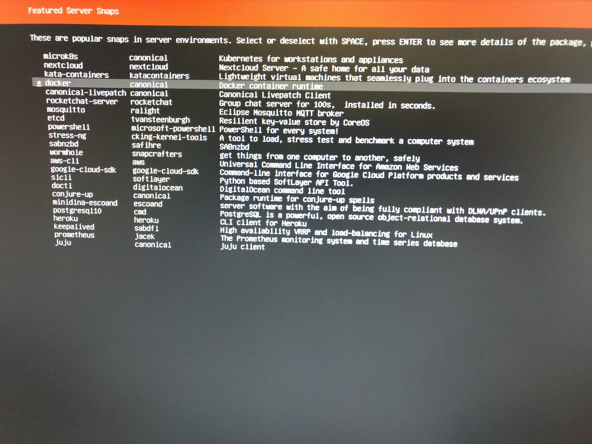
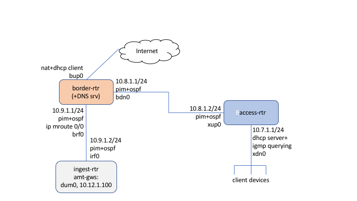

# Intro

This subdirectory contains scripts to build a small and cheap but
functional physical network that's compatible with the multicast
ingest platform, in that:

  - it will propagate PIM joins for external sources to the ingest-rtr
  - it will forward multicast traffic from outside the network to the receivers

The expectation is that if you're running the devices in this network,
you'll also have the ingest-rtr from the main section of the repo attached
to the brf0 interface of what I'm calling the "border router".

(NB: This border router is for travel and home/small office use, and it
just uses dhcp to get an assigned upstream IP and has its default route
point out that way, almost making the full local network look like a
single consumer device.  It's not actually configured as what you'd usually
call a "border router", with BGP.  FRR does support BGP and you can
configure it if you want to by editing the contents of the files in
/etc/frr/ appropriately.)

# Platform

The devices I've used so far for the multicast ingest platform and its supporting network were the cheapest off-the-shelf microcomputers I've got lying around, suitable for traveling:

There's a few different devices I've used for different builds of this network, including:

 * [Zotac CI329 nano](https://www.zotac.com/us/product/mini_pcs/zbox-ci329-nano-windows-10-s-mode) (pictured)
 * [Minisforum Z83-F](https://store.minisforum.com/products/minisforum-z83-f-mini-pc)
 * [GUZILA Fanless Mini PC](https://www.amazon.com/gp/product/B07D9YX3W6)
   (This worked but is tight as the border-rtr because you use both USB ports for ethernet, so you can't also use a keyboard)

You'll need 2 of these (for the border-rtr and the access-rtr) plus another for your [ingest-rtr](../README.md) if you're using the same platform.

You'll need for your border-rtr to have 3 ethernet interfaces and your access-rtr to have 2, so for the minisforum or guzila you'll need an extra 3 [Ethernet-to-USB](https://www.amazon.com/gp/product/B083W4YVX8) adapters, or just 1 for the zotac since it has 2 ethernet ports built in.

Depending what kinds of receivers you'll be connecting, you'll also probably want an [ethernet switch](https://www.netgear.com/home/products/networking/switches/soho-ethernet-switches/gs305v3.aspx#tab-techspecs) to connect them, or possibly a wi-fi router.

If you use a wi-fi router, you'll need one that does [IGMP Proxying](https://tools.ietf.org/html/rfc4605).  I know the [Fritz!Box](https://en.avm.de/products/fritzbox/) and the [Nighthawk](https://kb.netgear.com/24085/How-do-I-view-the-WAN-settings-on-my-Nighthawk-router) include IGMP proxying support, and I also know [OpenWRT](https://openwrt.org/packages/start) with the mcproxy package installed works.

Anyway, these devices started this life as a default install of [Ubuntu Server 18.04](https://www.ubuntu.com/download/server).  You can stick with the defaults, or select the "docker" snap (or not--it'll be installed by the setup script on ingest-rtr).

I expect any setup suitable for FRRouting will work the same, but these instructions include all the commands and configs starting after completing this install and logging into the new machines.

After that, [Free Range Routing](https://frrouting.org/) is launched, and the config in this repo is applied on the border-rtr and the access-rtr (plus the ingest-rtr config), to bring up this very simple lab network:

Think of this as a simplified version of one of the [examples in the DRIAD spec](https://tools.ietf.org/html/rfc8777#section-2.3.1.1).

## Basic Setup

Normal lab machine setup:

 * add your keys and `chmod 0600 .ssh/authorized_keys`, if desired; maybe visudo to add `user ALL=NOPASSWD: ALL` at the end if you're crazy and/or well-isolated.

 * catch up your updates ([with thanks](https://serverfault.com/a/858361))
 * prevent your drive from filling up with old kernels over time, since updates are for some reason auto-downloaded but not auto-cleaned by default:
 * restart

  ~~~bash
  sudo bash -x -e <<EOF
  export DEBIAN_FRONTEND=noninteractive
  export APT_LISTCHANGES_FRONTEND=none
  echo 'libc6 libraries/restart-without-asking boolean true' | debconf-set-selections
  apt-get update
  apt-get --allow-downgrades --allow-remove-essential --allow-change-held-packages -o Dpkg::Options::="--force-confold" --force-yes -o Dpkg::Options::="--force-confdef" -fuy dist-upgrade
  apt-get -y autoremove
  echo 'Unattended-Upgrade::Remove-Unused-Dependencies "true";' | \
    sudo tee -a /etc/apt/apt.conf.d/50unattended-upgrades
  reboot
  EOF
  ~~~

## Setup Scripts

The basic process for each of the routers is the same, from the different directories:

 * `border-rtr/`
 * `access-rtr/`

~~~bash
git clone https://github.com/GrumpyOldTroll/multicast-ingest-platform.git
cd multicast-ingest-platform/
# either border-rtr, access-rtr, or ingest-rtr
cd border-rtr/
./setup.sh
sudo shutdown -r now
~~~

After a successful install, it should be possible to reboot and come back up gracefully.

For ease of config, I've got dhcp client on for ingest-rtr and access-rtr running on the upstream interface, so it still should work ok after configuring it, whether or not you're running through the border-rtr and have the topology set up, in theory.

Check the scripts for details.  In both cases, it builds frr locally from source and installs it, and turns on ip forwarding.

If you're using USB-to-Ethernet adapters, you'll need them plugged for this stage (or it gives an early error for not having enough interfaces).  The config will incorporate the MAC of the chosen adapter, so if you shuffle them later you'll need to update the config like the "Interface Setup" section below describes.

Extra details:

 * [border-rtr](border-rtr/setup.sh):
   * runs dhcp client upstream
   * runs dhcp server on both downstream interfaces (mainly for convenience during setup of the other 2, and could reasonably be turned off after they're up)
   * runs a dns server
   * runs a NAT with iptables for traffic from downstream
 * [access-rtr](access-rtr/setup.sh):
   * runs dhcp server downstream
   * uses border-rtr's dns server

## Interface Setup

### Interface Names

This section is about the cryptic messages you should hopefully get about interface names and mac addresses at the end of setup.sh.

Ubuntu 18 started using interface names that [depend on the hardware](https://www.freedesktop.org/wiki/Software/systemd/PredictableNetworkInterfaceNames/).

There are pros and cons to that, but with the USB-to-Ethernet adapters I'm using, I was getting names that incorporate the MAC address (e.g. "enxc8b3730f34bc"), which makes the network config files non-portable to other systems if used directly.

I'm working around this by MAC address with [udev rules](https://wiki.debian.org/udev).  I'm auto-generating the mac addresses from the output of `ip link show`, so things might go wrong if there's any unexpected slight mismatches.

If you want to use the config files from this setup as they stand, you MUST use the exact interface names here, with your own MAC addresses (or other selection criteria).

You can of course configure your system as you like and change the names, but you should make sure to change them in all the other config files also, or your packets are going to have a bad day.

Some claim that changing udev rules also requires `sudo update-initramfs -u' to get it to work, but that was not my experience with Ubuntu 18.04.2.  YMMV, but try that if you're having trouble.

The setup.sh scripts attempt to generate these files, but you should check them to make sure the interfaces are the ones you want, and edit them if necessary.

 * /etc/udev/rules.d/10-border-rtr-inames.rules
 * /etc/udev/rules.d/10-access-rtr-inames.rules

The interface names to configure are:

 * border-rtr:
   * bup0: border-rtr upstream
   * bdn0: border-rtr downstream
   * brf0: border-rtr reflector
 * access-rtr:
   * xup0: access-rtr upstream
   * xdn0: access-rtr downstream

#### Example

This is an example of what one of the udev rules might look like.

Remember to use your own mac addresses.

~~~bash
# /etc/udev/rules.d/10-border-rtr-inames.rules
# upstream, to internet
SUBSYSTEM=="net", ACTION=="add", DRIVERS=="?*", ATTR{address}=="00:e0:4c:c1:55:1e", NAME="bup0"
# downstream, to access router
SUBSYSTEM=="net", ACTION=="add", DRIVERS=="?*", ATTR{address}=="c8:b3:73:0f:34:bc", NAME="bdn0"
# reflector, to ingest router
SUBSYSTEM=="net", ACTION=="add", DRIVERS=="?*", ATTR{address}=="c8:b3:73:0f:2f:c4", NAME="brf0"
~~~

#### Side note on alternate approachs

There are other approaches besides the one I'm using for configuring interface names.  It looks like [systemd.link](https://www.freedesktop.org/software/systemd/man/systemd.link.html) is a recommended way to do this, by creating files with names ending in ".link" in /etc/systemd/network or /usr/lib/systemd/network.  However, it didn't work for me on Ubuntu 18.04.2.  Perhaps this will change in the future, and if you're having trouble with the udev rules, consider trying it.

#### Side note on name choice

In the access-rtr, I'm using xdn0 and xup0 instead of adn0 and aup0.

I _think_ there's a bug, presumably in docker, that has to do with the interface loading order, such that a docker container that tries to use interfaces with a lexically earlier name than 'bridge' has problems hooking up the interfaces properly.

This may need further investigation, but when I was running frr inside a docker container, it worked with xup/xdn after NOT working with aup/adn.  Saw the same behavior one other time in a different context, but haven't dug in well enough to make a solid bug report.

### Netplan

The script also sets up netplan to use these interfaces instead of the auto-configured interface name:

 * [/etc/netplan/10-border-rtr-init.yaml](config/border-rtr/etc/netplan/10-border-rtr-init.yaml)
 * [/etc/netplan/10-access-rtr-init.yaml](config/access-rtr/etc/netplan/10-access-rtr-init.yaml)

These should match up with the network diagram, but if you've messed with anything, you'll want to make sure to update these.

Notes:

 1. access-rtr uses a static IP and assumes connectivity through the border-rtr.  border-rtr offers dhcp server through both interfaces, so it _should_ work to just plug in the upstream connection through border-rtr while configuring access-rtr and ingest-rtr, and then if everything's hooked up right, it'll all be fine when it reboots.  But sometimes there's trouble.

 2. the access-rtr netplan uses the border router's recursive DNS server.  This lets border-rtr inject DRIAD answers for testing setups that don't have globally deployed DNS zones.

    See this [example DRIAD zone file](border-rtr/etc/bind/zones/reverse.185.212.23.in-addr.arpa.zone).  This example is no longer loaded because now there's now global TYPE260 records for the reverse zone for 23.212.185.x, but earlier testing versions of this setup loaded this zone file in the border-rtr's bind instance, and you may want to configure similar for your own addresses.

## Poke around

Once it's all set up, you should be able to plug in a client downstream of the access (it should get an address automatically with dhcp), and have it do a SSM join (for instance with [iperf-ssm](https://github.com/GrumpyOldTroll/iperf-ssm)), and see pimwatch on border-rtr react by trying to find an AMT relay, and subscribing to traffic if possible.

For example, this should work if you've got docker and my sender is still alive and properly configured (you get about 1 packet per second, and it's a good way to watch the pcaps from various points on the network):

~~~bash
docker run -it --rm --name rx2 grumpyoldtroll/iperf-ssm:latest --server --udp --bind 232.10.1.1 --source 23.212.185.5 --interval 1 --len 1500 --interface eth0
~~~

The frr config is in /etc/frr/.

The running frr process is basically sort-of like a Cisco IOS command line with slightly different commands, if you run vtysh to connect to it:

~~~bash
sudo /usr/bin/vtysh
border-rtr# show ip pim neighbor
Interface         Neighbor    Uptime  Holdtime  DR Pri
bdn0              10.8.1.2  00:02:38  00:01:37       1
brf0              10.9.1.2  00:02:38  00:01:37       1
~~~

And be sure to read through the [user manual](http://docs.frrouting.org/en/latest/).
